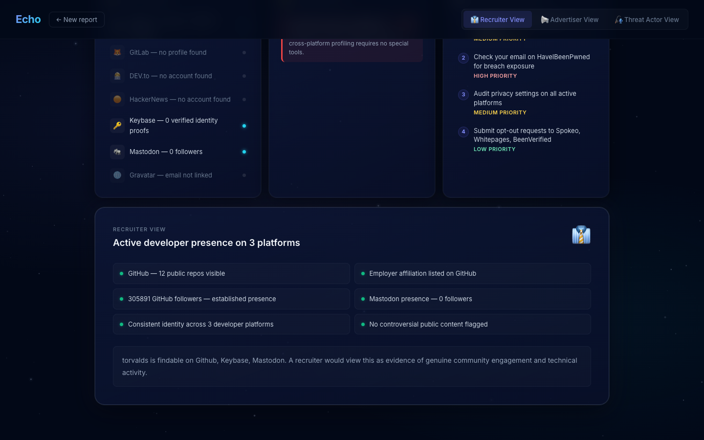
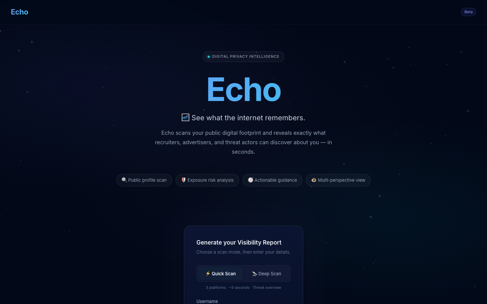
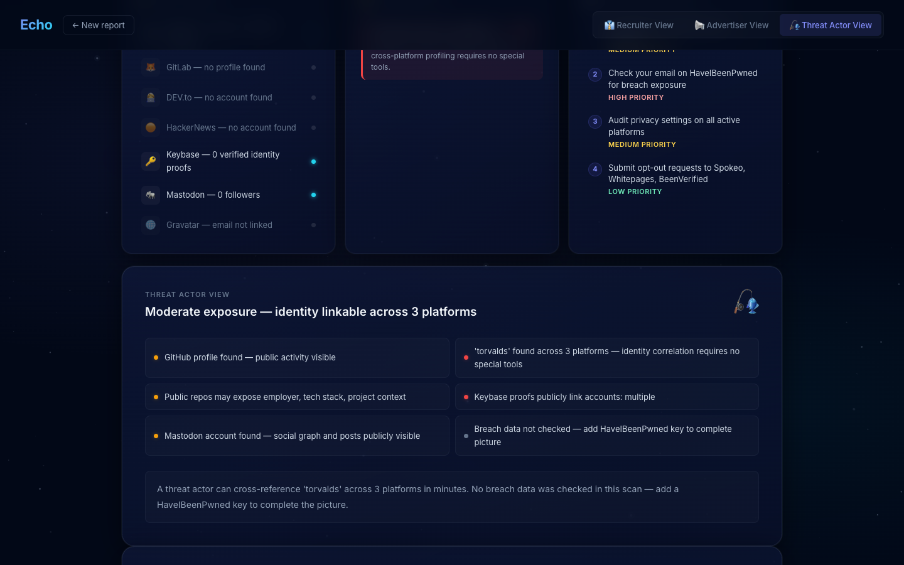

# Echo

A privacy intelligence tool that scans someone's public digital footprint and shows what recruiters, advertisers, and threat actors can discover about them.

**[Live Demo →](https://echo-psi-six.vercel.app)**



<details>
<summary>More screenshots</summary>




</details>

---

## What it does

Enter a username and email. Echo concurrently queries GitHub, GitLab, DEV.to, HackerNews, Keybase, Mastodon, and Gravatar, then runs DNS and WHOIS analysis on any linked domain. The result is a structured privacy report with a visibility score, detected exposure risks, and recommended actions — plus three different lenses on the same data:

- **Recruiter view** — how the profile reads to a hiring manager
- **Advertiser view** — what ad networks can infer from public signals
- **Threat Actor view** — realistic attack vectors with [MITRE ATT&CK](https://attack.mitre.org/tactics/TA0043/) technique mapping

Two scan modes: **Quick** (3 platforms, ~5s) and **Deep** (7 platforms + DNS/WHOIS, ~15s).

---

## Stack

**Frontend** — React 18, Vite 5, vanilla CSS (no component library)

**Backend** — FastAPI, async OSINT via `httpx`, DNS via `dnspython`, WHOIS via `python-whois`

All 7 platform checks run concurrently with `asyncio.gather`. WHOIS runs in a thread executor to avoid blocking the event loop.

---

## Running locally

```bash
# Backend
cd backend
.venv/bin/uvicorn app.main:app --reload

# Frontend (separate terminal)
cd frontend
npm install && npm run dev
```

Frontend runs at `http://localhost:5173`. The Vite dev server proxies `/api/*` to the backend at `http://localhost:8000`.

---

## Deployment

Backend is configured for [Render](https://render.com) via `render.yaml`. Frontend deploys to [Vercel](https://vercel.com) from the `frontend/` directory — `vercel.json` rewrites `/api/*` to the Render service.

After deploying the backend, update the destination URL in `frontend/vercel.json` to match your Render service URL, then push to deploy Vercel.

---

Zara Hameedi — B.S. Computer Science, Pace University
